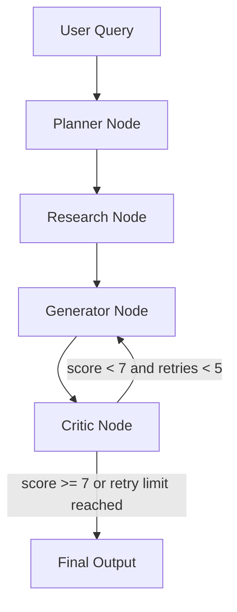
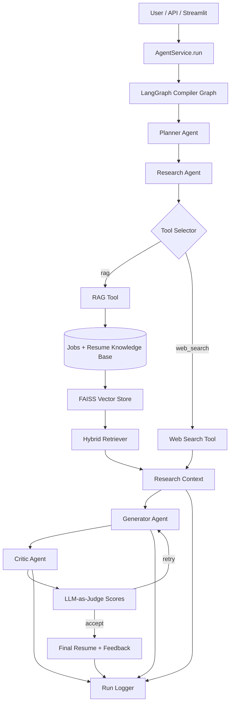
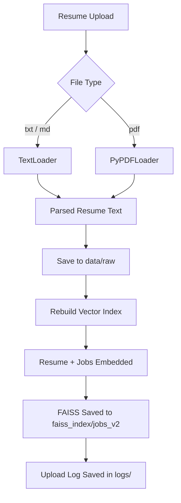

# AURA Architecture

This document describes the system flow of AURA AI Agent and mirrors the LangGraph execution path used by the project.

## High-Level View

AURA has three major layers:

1. Interface layer
   - `FastAPI`
   - `Streamlit`
2. Orchestration layer
   - `LangGraph`
   - planner, research, generator, critic nodes
3. Knowledge and execution layer
   - local RAG over jobs + resume
   - OpenAI LLM calls
   - Tavily web search fallback
   - run logging

## LangGraph-Style Flow



## Expanded Execution Graph



## Runtime Resume Ingestion Flow



## Node Responsibilities

### Planner Node

- input: user query
- output: short execution plan
- purpose: shape the downstream work

### Research Node

- input: user query
- output: grounded job context
- purpose: choose between local retrieval and web search

### Generator Node

- input: research context + optional critic feedback
- output: tailored Markdown resume
- purpose: generate a stronger, role-targeted resume draft

### Critic Node

- input: context + generated resume
- output: score, verdict, feedback, rubric fields
- purpose: judge resume quality and decide whether to retry

## Retry Logic

Implemented in `app/graph/edges.py`:

```python
if score < 7 and retries < 5:
    return "retry"
return "end"
```

That creates a feedback loop:

```text
Generator -> Critic -> Generator -> Critic -> ... -> End
```

## Data Flow

### Inputs

- job descriptions from `data/raw/jobs.txt`
- resume source from `data/raw/resume.txt` or `data/raw/resume.pdf`
- user query from FastAPI or Streamlit

### Intermediate Data

- execution plan
- research context
- generated resume drafts
- critic evaluations

### Outputs

- final Markdown resume
- judge feedback and score
- run artifacts in `logs/run_<timestamp>/`

## Logging Flow

Each run produces:

- structured `run.json`
- research context artifact
- generated resume attempt artifacts
- critic evaluation attempt artifacts
- final resume and final feedback artifacts

This makes the graph behavior auditable step by step.

## Files to Know

- [app/graph/builder.py](C:/Users/abdus/Documents/aura-ai-agent/app/graph/builder.py)
- [app/graph/edges.py](C:/Users/abdus/Documents/aura-ai-agent/app/graph/edges.py)
- [app/graph/nodes.py](C:/Users/abdus/Documents/aura-ai-agent/app/graph/nodes.py)
- [app/rag/pipeline.py](C:/Users/abdus/Documents/aura-ai-agent/app/rag/pipeline.py)
- [app/rag/loader.py](C:/Users/abdus/Documents/aura-ai-agent/app/rag/loader.py)
- [app/api/service.py](C:/Users/abdus/Documents/aura-ai-agent/app/api/service.py)
- [streamlit_app.py](C:/Users/abdus/Documents/aura-ai-agent/streamlit_app.py)
